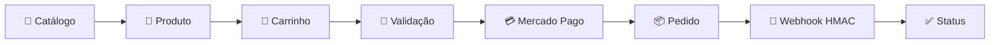
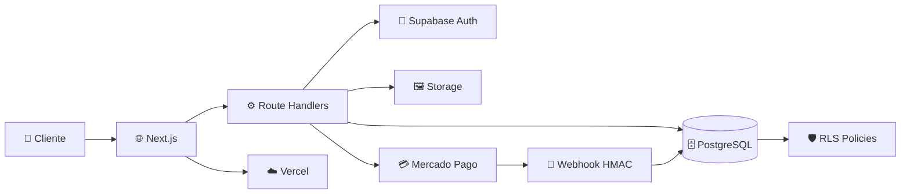
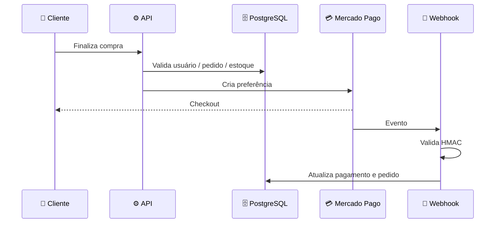
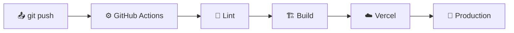

<div align="center">



<br/>
<br/>

# 🛍️ Loja — E-commerce Full-Stack

### **Construída para vender. Projetada para crescer.**

**Next.js · React · TypeScript · Supabase · PostgreSQL · Mercado Pago · Vercel**

[](https://nextjs.org/) [](https://react.dev/) [](https://www.typescriptlang.org/)

[](https://supabase.com/) [](https://www.mercadopago.com.br/) [](https://vercel.com/)

<br/>

**⚡ Performance** · **🔐 Security-first** · **💳 Payments** · **📦 Inventory** · **👑 Admin** · **☁️ Cloud**

<br/>

<a href="https://loja-nine-gold.vercel.app/"><strong>🚀 Live Demo</strong></a> ·
<a href="https://www.canva.com/d/l3K1BCLrMlMFhlp"><strong>🎨 Brand Deck</strong></a> ·
<a href="https://github.com/XzGuuhXz/loja/issues"><strong>🐛 Issues</strong></a>

</div>

<div align="center">

## 💚 Uma experiência de compra. Uma plataforma de negócio.

**Simples para quem compra. Poderosa para quem vende. Segura por arquitetura.**

</div>

> A Loja não trata o navegador como autoridade. **Preço, estoque, autenticação, autorização, pedidos e pagamentos** são regras de negócio protegidas por backend e banco de dados.

---

## 📈 The Store Keeps Growing

<div align="center">

| 🛒 Storefront | 👑 Backoffice | 🔐 Security | ☁️ Cloud |
|:---:|:---:|:---:|:---:|
| Catálogo | Produtos | RLS | Vercel |
| Busca | Categorias | Auth | Supabase |
| Carrinho | Estoque | Server-side | PostgreSQL |
| Checkout | Pedidos | HMAC | CI/CD |

<br/>

**→ Evolução contínua · novas experiências · melhorias de segurança · infraestrutura preparada para escala**

</div>

<br/>

## ⭐ Apoie o projeto

<div align="center">

### **Se a Loja te ajudou, deixe uma estrela e acompanhe a evolução.**

[](https://github.com/XzGuuhXz/loja)
[](https://github.com/XzGuuhXz/loja)
[](https://github.com/XzGuuhXz/loja/issues)

</div>

---

## 🧭 Navegação

<table align="center">
  <tr>
    <td align="right"><b>🚀 Comece</b></td>
    <td align="center"><a href="#-quick-start">Quick Start</a></td>
    <td align="center"><a href="#-funcionalidades">Funcionalidades</a></td>
    <td align="center"><a href="#-loja-in-action">In Action</a></td>
  </tr>
  <tr>
    <td align="right"><b>💡 Produto</b></td>
    <td align="center"><a href="#-a-promessa">A Promessa</a></td>
    <td align="center"><a href="#-por-que-loja">Por que Loja?</a></td>
    <td align="center"><a href="#-o-que-diferencia-a-loja">Diferenciais</a></td>
  </tr>
  <tr>
    <td align="right"><b>⚙️ Engenharia</b></td>
    <td align="center"><a href="#-tech-stack">Tech Stack</a></td>
    <td align="center"><a href="#-arquitetura">Arquitetura</a></td>
    <td align="center"><a href="#-segurança">Segurança</a></td>
  </tr>
  <tr>
    <td align="right"><b>💳 Commerce</b></td>
    <td align="center"><a href="#-pagamentos">Pagamentos</a></td>
    <td align="center"><a href="#-banco-de-dados">Banco</a></td>
    <td align="center"><a href="#-administração">Administração</a></td>
  </tr>
  <tr>
    <td align="right"><b>📦 Projeto</b></td>
    <td align="center"><a href="#-estrutura">Estrutura</a></td>
    <td align="center"><a href="#-quick-start">Desenvolvimento</a></td>
    <td align="center"><a href="#-deploy">Deploy</a></td>
  </tr>
</table>

---

## 💥 A Promessa

<div align="center">

### **Comprar deve ser fácil. Administrar deve ser poderoso. Proteger deve ser obrigatório.**

</div>

A Loja foi pensada como **produto**, não apenas como uma página de catálogo. A experiência do cliente é direta, enquanto as decisões críticas ficam sob responsabilidade do servidor e do banco.

```text
CLIENTE
   │
   ├── 🔎 Descobre
   ├── 🛒 Escolhe
   ├── 💳 Compra
   └── 📦 Acompanha
          │
          ▼
     LOJA / BACKEND
          │
   ┌──────┼─────────┐
   ▼      ▼         ▼
  AUTH   STOCK    PAYMENT
   │      │         │
   └──────┴────┬────┘
                ▼
          🗄️ DATABASE
```

---

## 🤔 Por que Loja?

| Antes | Com a Loja |
|---|---|
| Frontend decide regras críticas | Backend valida operações críticas |
| Estoque confiado ao navegador | Estoque protegido no banco |
| Checkout expõe lógica sensível | Preferência criada server-side |
| Admin depende apenas da interface | Autorização server-side |
| Webhook aceito sem verificar origem | HMAC valida a assinatura |
| Secrets espalhados pelo projeto | Credenciais restritas ao servidor |

---

## 🏆 O que diferencia a Loja

### 🔐 Security-first

RLS, autenticação, autorização server-side, validação e secrets trabalham juntos. Segurança faz parte da arquitetura desde o início.

### 💳 Pagamentos como fluxo confiável

O cliente inicia a compra, o servidor valida o pedido e cria a preferência, e o webhook processa o retorno após validar sua assinatura.

### 📦 Estoque como regra de negócio

Preço e disponibilidade não são aceitos cegamente do cliente. Dados persistidos são consultados antes de operações sensíveis.

### ☁️ Full-stack de verdade

Frontend, backend, autenticação, banco, storage e integrações vivem em uma arquitetura coesa e preparada para cloud.

---

## 🚀 Funcionalidades

<table>
<tr><td><b>🛍️ Storefront</b></td><td><b>👑 Administração</b></td><td><b>⚙️ Engenharia</b></td></tr>
<tr><td>🏪 Catálogo</td><td>📋 CRUD de produtos</td><td>🛡️ PostgreSQL + RLS</td></tr>
<tr><td>🔎 Busca e filtros</td><td>🗂️ CRUD de categorias</td><td>🔏 Webhook HMAC</td></tr>
<tr><td>🖼️ Imagens</td><td>📊 Controle de estoque</td><td>✅ Validação com Zod</td></tr>
<tr><td>🛒 Carrinho</td><td>🖼️ Gestão de imagens</td><td>🔑 Secrets server-only</td></tr>
<tr><td>👤 Auth</td><td>📦 Gestão de pedidos</td><td>🌐 Security headers</td></tr>
<tr><td>💳 Checkout</td><td>🔐 Autorização server-side</td><td>🔄 CI + Build</td></tr>
</table>

---

## 🎬 Loja in Action


<br/>

**1. Descobrir → 2. Escolher → 3. Carrinho → 4. Validar → 5. Pagar → 6. Acompanhar pedido**



---

## 👑 Administração

A área administrativa concentra o controle operacional da loja:

| Módulo | Responsabilidade |
|---|---|
| 📦 Produtos | Cadastro, edição e disponibilidade |
| 🗂️ Categorias | Organização do catálogo |
| 📊 Estoque | Controle de quantidade |
| 🖼️ Imagens | Upload e gerenciamento |
| 🧾 Pedidos | Acompanhamento operacional |
| 🔐 Acesso | Regras de autorização |

> A interface administrativa não é uma barreira de segurança. As regras importantes são verificadas no servidor e no banco.

---

## 🎨 Identidade visual

<div align="center">



### **Premium · Tecnológica · Limpa · Confiável**

`GRAPHITE` · `WHITE` · `EMERALD` · `CYAN`

<br/>

<a href="https://www.canva.com/d/l3K1BCLrMlMFhlp"><strong>🎨 Abrir Brand Deck no Canva</strong></a>

</div>

---

## 🏗️ Arquitetura



---

## 🧰 Tech Stack

| Tecnologia | Papel | Por quê |
|---|---|---|
| **Next.js 15** | Full-stack | App Router + Route Handlers |
| **React 19** | UI | Componentização |
| **TypeScript 5** | Código | Tipagem estática |
| **Tailwind CSS** | Design | Interface consistente |
| **Supabase Auth** | Auth | Sessão e identidade |
| **PostgreSQL** | Dados | Persistência relacional |
| **Supabase Storage** | Assets | Imagens de produtos |
| **Zod** | Validação | Dados confiáveis |
| **Mercado Pago** | Payments | Checkout brasileiro |
| **Vercel** | Cloud | Deploy e hosting |
| **GitHub Actions** | CI | Automação de qualidade |

---

## 🔐 Segurança

> **O navegador é cliente. Nunca autoridade.**

| Camada | Proteção |
|---|---|
| 🔐 Auth | Supabase Auth |
| 🛡️ Database | PostgreSQL + RLS |
| 👑 Admin | Autorização server-side |
| 💰 Pricing | Validação baseada no banco |
| 📦 Inventory | Operações protegidas |
| 💳 Checkout | Preferência criada no servidor |
| 🔏 Webhook | HMAC |
| 🔑 Service Role | Server-only |
| 🖼️ Upload | MIME + limite de tamanho |
| 🌐 HTTP | Security headers |
| 🚫 Repository | Secrets fora do Git |

---

## 💳 Pagamentos



### Princípio central

**Cliente inicia → servidor valida → Mercado Pago processa → webhook confirma → banco atualiza.**

As credenciais do Mercado Pago permanecem **server-only**.

---

## 🗄️ Banco de dados

```text
                    ┌──────────────┐
                    │   profiles   │
                    └──────┬───────┘
                           │
                    ┌──────▼───────┐
                    │    orders    │
                    └──────┬───────┘
                           │
                  ┌────────▼────────┐
                  │   order_items   │
                  └────────┬────────┘
                           │
┌──────────────┐    ┌──────▼───────┐    ┌──────────────┐
│  categories  │◀───│   products   │───▶│product_images│
└──────────────┘    └──────────────┘    └──────────────┘

┌──────────────┐    ┌──────────────┐
│    carts     │───▶│  cart_items  │───▶ products
└──────────────┘    └──────────────┘
```

### Entidades principais

`profiles` · `addresses` · `categories` · `products` · `product_images` · `carts` · `cart_items` · `orders` · `order_items`

---

## 📁 Estrutura

```text
loja/
├── app/
│   ├── api/pagamento/
│   ├── admin/
│   ├── auth/
│   ├── carrinho/
│   ├── pedidos/
│   ├── produtos/
│   ├── error.tsx
│   ├── layout.tsx
│   └── page.tsx
│
├── components/
├── lib/supabase/
├── supabase/migrations/
├── public/
├── assets/
├── .github/workflows/
├── .env.example
├── next.config.ts
├── package.json
└── README.md
```

---

## 🚀 Quick Start

```bash
git clone https://github.com/XzGuuhXz/loja.git
cd loja
npm install
npm run dev
```

Crie `.env.local` usando `.env.example`:

```env
NEXT_PUBLIC_SUPABASE_URL=seu_url_publico
NEXT_PUBLIC_SUPABASE_PUBLISHABLE_KEY=sua_chave_publica
SUPABASE_SERVICE_ROLE_KEY=chave_apenas_no_servidor
NEXT_PUBLIC_SITE_URL=http://localhost:3000
MERCADOPAGO_ACCESS_TOKEN=
MERCADOPAGO_WEBHOOK_SECRET=
```

Valide antes de publicar:

```bash
npm run lint
npm run build
```

> ⚠️ **Nunca** commite valores reais de secrets.

---

## ☁️ Deploy



### Variáveis de Production

```text
NEXT_PUBLIC_SUPABASE_URL
NEXT_PUBLIC_SUPABASE_PUBLISHABLE_KEY
SUPABASE_SERVICE_ROLE_KEY
NEXT_PUBLIC_SITE_URL
MERCADOPAGO_ACCESS_TOKEN
MERCADOPAGO_WEBHOOK_SECRET
```

> A publicação funcional em Production depende da configuração correta dessas variáveis e dos serviços externos.

---

## 🆕 Roadmap

| Área | Próximo passo |
|---|---|
| 🎨 UX | Refinar microinterações e estados de interface |
| 📱 Mobile | Evoluir experiência responsiva |
| 👑 Admin | Expandir métricas e ferramentas operacionais |
| 📊 Observabilidade | Melhorar monitoramento e diagnóstico |
| 🧪 Quality | Ampliar testes automatizados |
| 🌎 Commerce | Evoluir recursos de catálogo e pedidos |

---

## 📊 Status

| Módulo | Estado |
|---|:---:|
| Catálogo | ✅ |
| Busca e filtros | ✅ |
| Página de produto | ✅ |
| Carrinho | ✅ |
| Autenticação | ✅ |
| Pedidos | ✅ |
| Administração | ✅ |
| Produtos / categorias | ✅ |
| Storage / imagens | ✅ |
| Estoque | ✅ |
| Checkout | ✅ |
| Mercado Pago | ✅ |
| Webhook HMAC | ✅ |
| RLS | ✅ |
| CI / Build | ✅ |
| Production | ⚠️ Configuração |

---

## 🧪 Production Checklist

- [ ] Configurar secrets de Production
- [ ] Configurar domínio oficial
- [ ] Configurar webhook do Mercado Pago
- [ ] Testar autenticação
- [ ] Testar catálogo e filtros
- [ ] Testar carrinho
- [ ] Testar estoque
- [ ] Testar checkout
- [ ] Validar webhook HMAC
- [ ] Revisar RLS
- [ ] Executar lint + build
- [ ] Fazer deploy
- [ ] Validar aplicação publicada

---

## 🤝 Contribuição

```bash
git checkout -b feature/minha-melhoria
git add .
git commit -m "feat: minha melhoria"
git push origin feature/minha-melhoria
```

Depois, abra um Pull Request.

---

<div align="center">

## 🛍️ LOJA

### **Construída para vender. Projetada para crescer.**

**Simple for customers. Powerful for business. Secure by architecture.**

⭐ **Star the repo · Explore the code · Build on it** ⭐

<br/>

<a href="https://github.com/XzGuuhXz/loja">GitHub</a> ·
<a href="https://loja-nine-gold.vercel.app/">Live Demo</a> ·
<a href="https://www.canva.com/d/l3K1BCLrMlMFhlp">Brand Deck</a>

</div>
