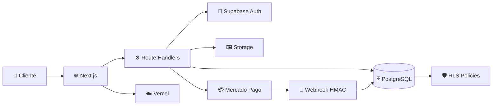
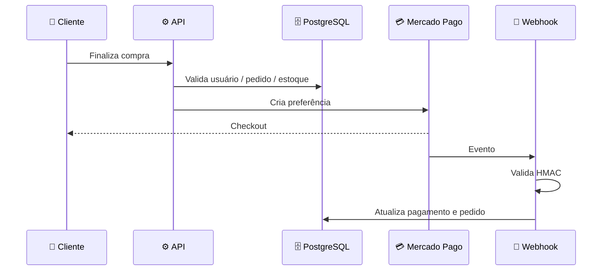
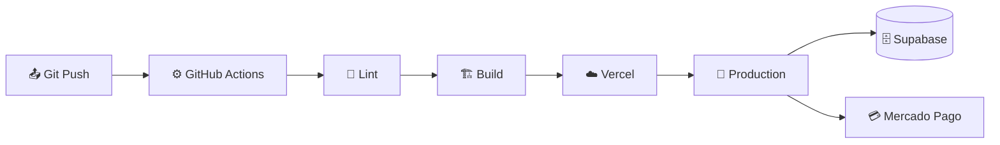

<div align="center">


<br/>
<br/>

# 🛍️ Loja — E-commerce Full-Stack

### **Construída para vender. Projetada para crescer.**

Uma experiência de compra moderna com **Next.js + Supabase + PostgreSQL + Mercado Pago + Vercel**.

[](https://nextjs.org/) [](https://react.dev/) [](https://www.typescriptlang.org/)

[](https://supabase.com/) [](https://www.mercadopago.com.br/) [](https://vercel.com/)

<br/>

**⚡ Performance** · **🔐 Security-first** · **💳 Payments** · **📦 Inventory** · **👑 Admin** · **☁️ Cloud**

<br/>

<a href="https://loja-nine-gold.vercel.app/"><strong>🚀 Live Demo</strong></a> ·
<a href="https://www.canva.com/d/l3K1BCLrMlMFhlp"><strong>🎨 Brand Deck</strong></a> ·
<a href="https://github.com/XzGuuhXz/loja/issues"><strong>🐛 Issues</strong></a>

</div>

<br/>

<div align="center">

## 💚 Uma loja pensada como produto

**Experiência simples para quem compra. Controle poderoso para quem vende. Segurança em cada camada.**

</div>

> E-commerce não é apenas catálogo + carrinho. A Loja foi estruturada para tratar **autenticação, preço, estoque, pedidos e pagamentos como regras de negócio**, mantendo as decisões críticas fora da confiança do navegador.

---

## 📊 The Store Keeps Growing

<div align="center">

| 🛒 Experiência | ⚙️ Operação | 🔐 Segurança | ☁️ Infraestrutura |
|:---:|:---:|:---:|:---:|
| Catálogo | Produtos | RLS | Vercel |
| Busca | Categorias | Auth | Supabase |
| Carrinho | Estoque | Server-side | PostgreSQL |
| Checkout | Pedidos | HMAC | CI/CD |

</div>

<br/>

## ⭐ Se a Loja te ajudou

<div align="center">

**⭐ Dê uma estrela no repositório e acompanhe a evolução do projeto.**

[](https://github.com/XzGuuhXz/loja)
[](https://github.com/XzGuuhXz/loja)
[](https://github.com/XzGuuhXz/loja/issues)

</div>

---

## 🧭 Navegação

<table align="center">
  <tr>
    <td align="right"><b>🚀 Comece</b></td>
    <td align="center"><a href="#-quick-start">Quick Start</a></td>
    <td align="center"><a href="#-funcionalidades">Funcionalidades</a></td>
    <td align="center"><a href="#-arquitetura">Arquitetura</a></td>
  </tr>
  <tr>
    <td align="right"><b>💡 Entenda</b></td>
    <td align="center"><a href="#-a-promessa">A Promessa</a></td>
    <td align="center"><a href="#-por-que-loja">Por que Loja?</a></td>
    <td align="center"><a href="#-o-que-diferencia-a-loja">Diferenciais</a></td>
  </tr>
  <tr>
    <td align="right"><b>⚙️ Engenharia</b></td>
    <td align="center"><a href="#-segurança">Segurança</a></td>
    <td align="center"><a href="#-pagamentos">Pagamentos</a></td>
    <td align="center"><a href="#-banco-de-dados">Banco</a></td>
  </tr>
  <tr>
    <td align="right"><b>👀 Veja</b></td>
    <td align="center"><a href="#-jornada-de-compra">Jornada</a></td>
    <td align="center"><a href="#-administração">Administração</a></td>
    <td align="center"><a href="#-identidade-visual">Identidade</a></td>
  </tr>
  <tr>
    <td align="right"><b>📦 Projeto</b></td>
    <td align="center"><a href="#-tech-stack">Tech Stack</a></td>
    <td align="center"><a href="#-estrutura">Estrutura</a></td>
    <td align="center"><a href="#-roadmap">Roadmap</a></td>
  </tr>
</table>

---

## 💥 A Promessa

<div align="center">

### **Comprar deve ser fácil. Administrar deve ser poderoso. Proteger deve ser obrigatório.**

</div>

A Loja combina uma interface de e-commerce moderna com uma arquitetura orientada a regras de negócio. O cliente vê uma experiência direta; o servidor e o banco garantem que operações críticas sejam realmente válidas.

---

## 🤔 Por que Loja?

| Antes | Com a Loja |
|---|---|
| Frontend decide regras críticas | Backend valida operações críticas |
| Estoque confiado ao navegador | Estoque protegido no banco |
| Checkout expõe lógica sensível | Preferência criada server-side |
| Admin baseado apenas na UI | Autorização server-side |
| Webhook aceito sem validação | HMAC para verificar origem |

---

## 🏆 O que diferencia a Loja

### 🔐 Security-first por arquitetura

Segurança não é uma tela ou um middleware isolado. **RLS, autenticação, autorização server-side, validação e secrets** trabalham juntos.

### 💳 Pagamentos tratados como fluxo confiável

O cliente inicia a compra, o servidor valida o pedido e cria a preferência, e o webhook processa o retorno do provedor após validar sua assinatura.

### 📦 Estoque como regra de negócio

Preço e disponibilidade não devem ser aceitos cegamente do cliente. O backend consulta e valida os dados persistidos antes de operações sensíveis.

### ☁️ Pronta para cloud

Next.js no frontend/backend, Supabase para dados e autenticação, Mercado Pago para pagamentos e Vercel para publicação.

---

## 🚀 Funcionalidades

### 🛍️ Experiência do cliente

- 🏪 Catálogo de produtos
- 🔎 Busca e filtros por categoria
- 🖼️ Imagens via Supabase Storage
- 🛒 Carrinho de compras
- 👤 Cadastro, login e sessão
- 📦 Histórico de pedidos
- 💳 Checkout com Mercado Pago

### 👑 Administração

- 📋 CRUD de produtos
- 🗂️ CRUD de categorias
- 📊 Controle de estoque
- 🖼️ Upload e gerenciamento de imagens
- 📦 Gestão de pedidos
- 🔐 Autorização administrativa server-side

### ⚙️ Engenharia

- 🛡️ PostgreSQL + Row Level Security
- 🔏 Webhook de pagamento com HMAC
- ✅ Validação server-side com Zod
- 🔑 Secrets somente no servidor
- 🌐 Security headers
- 🔄 CI com lint e build
- ☁️ Deploy preparado para Vercel

---

## 🎬 Loja in action

```text
┌──────────────┐     ┌──────────────┐     ┌──────────────┐
│ 🏪 CATÁLOGO  │ ──▶ │ 🛒 CARRINHO  │ ──▶ │ 💳 CHECKOUT  │
└──────────────┘     └──────────────┘     └──────────────┘
         │                    │                    │
         ▼                    ▼                    ▼
   🔎 Descobrir         📦 Revisar          🔐 Validar
   🖼️ Visualizar        💰 Total            💳 Pagar
         │                    │                    │
         └────────────────────┴────────────────────┘
                              │
                              ▼
                       📦 PEDIDO CRIADO
                              │
                              ▼
                       🔏 WEBHOOK HMAC
                              │
                              ▼
                        ✅ STATUS ATUALIZADO
```

### Jornada de compra

**1. Descobrir → 2. Escolher → 3. Carrinho → 4. Validar → 5. Pagar → 6. Acompanhar pedido**

---

## 👑 Administração

A área administrativa concentra o controle operacional da loja:

| Módulo | Responsabilidade |
|---|---|
| 📦 Produtos | Cadastro, edição e disponibilidade |
| 🗂️ Categorias | Organização do catálogo |
| 📊 Estoque | Controle de quantidade |
| 🖼️ Imagens | Upload e gerenciamento |
| 🧾 Pedidos | Acompanhamento operacional |
| 🔐 Acesso | Regras de autorização |

> A interface administrativa não é considerada uma barreira de segurança. As regras importantes são verificadas no servidor e no banco.

---

## 🎨 Identidade visual

<div align="center">

### **LOJA**

**Construída para vender. Projetada para crescer.**

`GRAPHITE` · `WHITE` · `EMERALD` · `CYAN`

**Premium · Tecnológica · Limpa · Confiável**

<br/>

<a href="https://www.canva.com/d/l3K1BCLrMlMFhlp">🎨 Abrir Brand Deck no Canva</a>

</div>

---

## 🏗️ Arquitetura



---

## 🧰 Tech Stack

| Tecnologia | Papel | Por quê |
|---|---|---|
| **Next.js 15** | Full-stack | App Router e backend integrado |
| **React 19** | UI | Componentização |
| **TypeScript 5** | Código | Tipagem estática |
| **Tailwind CSS** | Design | Interface consistente |
| **Supabase Auth** | Auth | Sessão e identidade |
| **PostgreSQL** | Dados | Persistência relacional |
| **Supabase Storage** | Assets | Imagens de produtos |
| **Zod** | Validação | Dados confiáveis |
| **Mercado Pago** | Payments | Checkout brasileiro |
| **Vercel** | Cloud | Deploy e hosting |
| **GitHub Actions** | CI | Automação de qualidade |

---

## 🔐 Segurança

> **O navegador é cliente. Nunca autoridade.**

| Camada | Proteção |
|---|---|
| 🔐 Auth | Supabase Auth |
| 🛡️ Database | PostgreSQL + RLS |
| 👑 Admin | Autorização server-side |
| 💰 Pricing | Validação baseada no banco |
| 📦 Inventory | Operações protegidas |
| 💳 Checkout | Preferência criada no servidor |
| 🔏 Webhook | HMAC |
| 🔑 Service Role | Server-only |
| 🖼️ Upload | MIME + limite de tamanho |
| 🌐 HTTP | Security headers |
| 🚫 Repository | Secrets fora do Git |

---

## 💳 Pagamentos



### Princípio central

**Cliente inicia → servidor valida → Mercado Pago processa → webhook confirma → banco atualiza.**

As credenciais do Mercado Pago permanecem **server-only**.

---

## 🗄️ Banco de dados

```text
                    ┌──────────────┐
                    │   profiles   │
                    └──────┬───────┘
                           │
                    ┌──────▼───────┐
                    │    orders    │
                    └──────┬───────┘
                           │
                  ┌────────▼────────┐
                  │   order_items   │
                  └────────┬────────┘
                           │
┌──────────────┐    ┌──────▼───────┐    ┌──────────────┐
│  categories  │◀───│   products   │───▶│product_images│
└──────────────┘    └──────────────┘    └──────────────┘

┌──────────────┐    ┌──────────────┐
│    carts     │───▶│  cart_items  │───▶ products
└──────────────┘    └──────────────┘
```

### Entidades principais

`profiles` · `addresses` · `categories` · `products` · `product_images` · `carts` · `cart_items` · `orders` · `order_items`

---

## 📁 Estrutura

```text
loja/
├── app/
│   ├── api/pagamento/
│   ├── admin/
│   ├── auth/
│   ├── carrinho/
│   ├── pedidos/
│   ├── produtos/
│   ├── error.tsx
│   ├── layout.tsx
│   └── page.tsx
│
├── components/
├── lib/supabase/
├── supabase/migrations/
├── public/
├── assets/
├── .github/workflows/
├── .env.example
├── next.config.ts
├── package.json
└── README.md
```

---

## 🚀 Quick Start

```bash
git clone https://github.com/XzGuuhXz/loja.git
cd loja
npm install
npm run dev
```

Crie `.env.local` a partir do `.env.example`:

```env
NEXT_PUBLIC_SUPABASE_URL=seu_url_publico
NEXT_PUBLIC_SUPABASE_PUBLISHABLE_KEY=sua_chave_publica
SUPABASE_SERVICE_ROLE_KEY=chave_apenas_no_servidor
NEXT_PUBLIC_SITE_URL=http://localhost:3000
MERCADOPAGO_ACCESS_TOKEN=
MERCADOPAGO_WEBHOOK_SECRET=
```

Valide antes de publicar:

```bash
npm run lint
npm run build
```

> ⚠️ Nunca commite valores reais de secrets.

---

## ☁️ Deploy



### Variáveis de Production

```text
NEXT_PUBLIC_SUPABASE_URL
NEXT_PUBLIC_SUPABASE_PUBLISHABLE_KEY
SUPABASE_SERVICE_ROLE_KEY
NEXT_PUBLIC_SITE_URL
MERCADOPAGO_ACCESS_TOKEN
MERCADOPAGO_WEBHOOK_SECRET
```

---

## 🆕 O que vem a seguir

### Roadmap

- [ ] 🌐 Domínio oficial
- [ ] 📸 Galeria visual da aplicação no README
- [ ] 🧪 Testes automatizados de fluxos críticos
- [ ] 📊 Observabilidade e métricas
- [ ] 🚚 Melhorias no fluxo de pedidos
- [ ] 🎟️ Cupons e promoções
- [ ] 📈 Dashboard comercial
- [ ] 📱 Experiência mobile ainda mais refinada

> O roadmap é evolutivo: novas melhorias podem ser adicionadas conforme o produto avança.

---

## 📈 Status atual

| Módulo | Estado |
|---|:---:|
| Catálogo | ✅ |
| Busca e filtros | ✅ |
| Página de produto | ✅ |
| Carrinho | ✅ |
| Autenticação | ✅ |
| Pedidos | ✅ |
| Administração | ✅ |
| Produtos / categorias | ✅ |
| Storage / imagens | ✅ |
| Estoque | ✅ |
| Checkout | ✅ |
| Mercado Pago | ✅ |
| Webhook HMAC | ✅ |
| RLS | ✅ |
| CI / Build | ✅ |
| Production | ⚠️ Secrets / configuração |

---

## 🧪 Production Checklist

- [ ] Configurar secrets de Production
- [ ] Configurar domínio oficial
- [ ] Configurar webhook do Mercado Pago
- [ ] Testar autenticação
- [ ] Testar catálogo e filtros
- [ ] Testar carrinho
- [ ] Testar estoque
- [ ] Testar checkout
- [ ] Validar webhook HMAC
- [ ] Revisar RLS
- [ ] Executar lint + build
- [ ] Fazer deploy
- [ ] Validar aplicação publicada

---

## 🤝 Contribuição

```bash
git checkout -b feature/minha-melhoria
git add .
git commit -m "feat: minha melhoria"
git push origin feature/minha-melhoria
```

Depois, abra um Pull Request descrevendo **o que mudou, por quê e como testar**.

---

## 📚 Recursos

- 🎨 **Identidade:** [Brand Deck no Canva](https://www.canva.com/d/l3K1BCLrMlMFhlp)
- 🚀 **Aplicação:** [Loja — Vercel](https://loja-nine-gold.vercel.app/)
- 🐙 **Código:** [GitHub — XzGuuhXz/loja](https://github.com/XzGuuhXz/loja)
- 🐛 **Discussões:** [GitHub Issues](https://github.com/XzGuuhXz/loja/issues)

---

<div align="center">

<br/>

# 🛍️ LOJA

### **Construída para vender. Projetada para crescer.**

**Simple for customers. Powerful for business. Secure by architecture.**

<br/>

⭐ **Star the repo · Build · Ship · Grow** ⭐

<br/>

</div>
