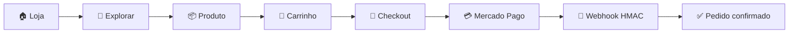
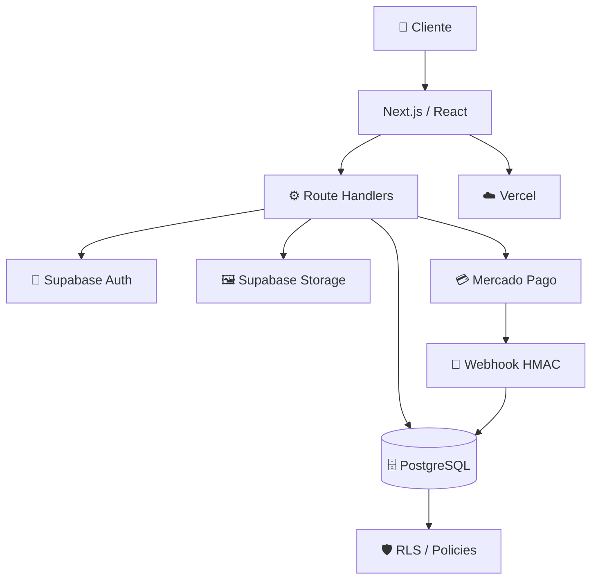
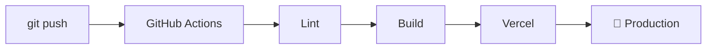

<div align="center">

# 🛍️ LOJA

### **Construída para vender. Projetada para crescer.**

E-commerce moderno, seguro e escalável para experiências de compra rápidas, confiáveis e profissionais.

[](https://nextjs.org/) [](https://react.dev/) [](https://www.typescriptlang.org/)

[](https://supabase.com/) [](https://www.mercadopago.com.br/) [](https://vercel.com/)

**⚡ Full-stack · 🔐 Security-first · 💳 Payments · 📦 Inventory · 👑 Admin · ☁️ Cloud**

<br/>

<a href="https://www.canva.com/d/l3K1BCLrMlMFhlp"><strong>🎨 Ver identidade visual no Canva →</strong></a>

</div>

---

## ✨ Uma loja pensada como produto

> **Não é apenas um catálogo. É uma plataforma de comércio.**

A **Loja** combina uma interface moderna com uma arquitetura full-stack orientada a segurança. O cliente navega, pesquisa, adiciona produtos ao carrinho e compra; enquanto as regras críticas — preço, estoque, autorização e pagamento — são protegidas no servidor e no banco.

<div align="center">

| 🛒 Compra | 🔐 Segurança | ⚡ Performance | 📊 Gestão |
|:---:|:---:|:---:|:---:|
| Catálogo → Checkout | RLS + Auth | Next.js + Vercel | Admin + Estoque |

</div>

---

## 🎨 Identidade visual

A identidade foi criada para transmitir **confiança, tecnologia e conversão**, com linguagem premium e limpa.

**Direção:** grafite · branco · verde-esmeralda · azul-ciano · alto contraste · espaço em branco · cards de produto · microinterações.

> 🎨 **Brand deck:** [abrir a apresentação visual da Loja no Canva](https://www.canva.com/d/l3K1BCLrMlMFhlp)

---

## 🚀 Funcionalidades

### Experiência de compra

- 🏪 Catálogo de produtos
- 🔎 Busca e filtros por categoria
- 🖼️ Imagens via Supabase Storage
- 🛒 Carrinho
- 👤 Cadastro, login e sessão
- 📦 Pedidos e histórico de compras
- 💳 Checkout com Mercado Pago

### Operação

- 👑 Painel administrativo
- 📋 CRUD de produtos e categorias
- 📊 Controle de estoque
- 🔏 Webhook de pagamentos com HMAC
- 🛡️ RLS e políticas PostgreSQL
- ⚙️ Validação server-side
- 🔄 CI com lint e build
- ☁️ Deploy preparado para Vercel

---

## 🧭 Jornada do cliente



---

## 🏗️ Arquitetura



### Stack

| Tecnologia | Responsabilidade |
|---|---|
| **Next.js 15** | Framework full-stack |
| **React 19** | Interface |
| **TypeScript** | Tipagem estática |
| **Tailwind CSS** | Estilos |
| **Supabase Auth** | Autenticação |
| **PostgreSQL** | Persistência |
| **Supabase Storage** | Imagens |
| **Zod** | Validação |
| **Mercado Pago** | Pagamentos |
| **Vercel** | Deploy / hosting |
| **GitHub Actions** | CI |

---

## 🔐 Security-first

A segurança é parte da arquitetura — não uma camada adicionada depois.

| Camada | Proteção |
|---|---|
| 🔐 Identidade | Supabase Auth |
| 🛡️ Banco | PostgreSQL + RLS |
| 👑 Admin | Autorização server-side + `private.is_admin()` |
| 💰 Preços | Dados confiáveis do banco |
| 📦 Estoque | Controle transacional |
| 💳 Checkout | Preferência criada no servidor |
| 🔏 Webhook | Assinatura HMAC |
| 🔑 Secrets | Service Role restrita ao servidor |
| 🖼️ Uploads | MIME types + limite de 5 MiB |
| 🌐 HTTP | Security headers |
| 🚫 Git | Segredos fora do repositório |

> **Regra de ouro:** o frontend nunca deve ser a autoridade para preço, estoque, permissões ou credenciais.

---

## 🗄️ Modelo de dados

```text
profiles
   ├── addresses
   └── orders
          └── order_items ─── products ─── categories
                                  └── product_images

carts
   └── cart_items ─── products
```

Principais tabelas: `profiles` · `categories` · `products` · `product_images` · `carts` · `cart_items` · `addresses` · `orders` · `order_items`

---

## 💳 Pagamentos

```text
Carrinho → API server-side → validações → preferência
                                      ↓
                                Mercado Pago
                                      ↓
                                  pagamento
                                      ↓
                              webhook assinado
                                      ↓
                                validação HMAC
                                      ↓
                              pedido atualizado
```

Endpoint do webhook: `/api/pagamento/webhook`

Secrets do Mercado Pago permanecem **server-only**.

---

## 📁 Estrutura

```text
loja/
├── app/
│   ├── api/pagamento/
│   ├── admin/
│   ├── auth/
│   ├── carrinho/
│   ├── pedidos/
│   ├── produtos/
│   ├── error.tsx
│   ├── layout.tsx
│   └── page.tsx
├── components/
├── lib/supabase/
├── supabase/migrations/
├── public/
├── .github/workflows/
├── .env.example
├── next.config.ts
├── package.json
└── README.md
```

---

## 🧑‍💻 Desenvolvimento local

```bash
git clone https://github.com/XzGuuhXz/loja.git
cd loja
npm install
npm run dev
```

Configure `.env.local` a partir do `.env.example`:

```env
NEXT_PUBLIC_SUPABASE_URL=seu_url_publico
NEXT_PUBLIC_SUPABASE_PUBLISHABLE_KEY=sua_chave_publica
SUPABASE_SERVICE_ROLE_KEY=chave_apenas_no_servidor
NEXT_PUBLIC_SITE_URL=http://localhost:3000
MERCADOPAGO_ACCESS_TOKEN=
MERCADOPAGO_WEBHOOK_SECRET=
```

Validação:

```bash
npm run lint
npm run build
```

> ⚠️ Nunca faça commit de valores reais das variáveis de ambiente.

---

## ☁️ Deploy

A aplicação está preparada para **Vercel + Supabase**.

Variáveis necessárias em **Production**:

```text
NEXT_PUBLIC_SUPABASE_URL
NEXT_PUBLIC_SUPABASE_PUBLISHABLE_KEY
SUPABASE_SERVICE_ROLE_KEY
NEXT_PUBLIC_SITE_URL
MERCADOPAGO_ACCESS_TOKEN
MERCADOPAGO_WEBHOOK_SECRET
```



---

## 📊 Status atual

| Módulo | Estado |
|---|:---:|
| Catálogo | ✅ |
| Busca e filtros | ✅ |
| Página de produto | ✅ |
| Carrinho | ✅ |
| Autenticação | ✅ |
| Pedidos | ✅ |
| Área administrativa | ✅ |
| CRUD de produtos | ✅ |
| CRUD de categorias | ✅ |
| Storage / imagens | ✅ |
| Estoque | ✅ |
| Checkout | ✅ |
| Mercado Pago | ✅ |
| Webhook HMAC | ✅ |
| RLS | ✅ |
| Headers de segurança | ✅ |
| CI / Build | ✅ |
| Production Vercel | ⚠️ Secrets necessários |

> O código e a infraestrutura continuam em evolução. A publicação funcional em Production depende da configuração dos secrets da Vercel.

---

## 🧪 Checklist de produção

- [ ] Configurar variáveis Production na Vercel
- [ ] Configurar domínio oficial
- [ ] Configurar webhook do Mercado Pago
- [ ] Validar login e cadastro
- [ ] Testar carrinho e estoque
- [ ] Testar checkout
- [ ] Testar retorno do webhook
- [ ] Confirmar RLS e permissões
- [ ] Executar lint e build
- [ ] Fazer deploy
- [ ] Validar aplicação publicada

---

## 🤝 Contribuindo

```bash
git checkout -b feature/minha-melhoria
git add .
git commit -m "feat: minha melhoria"
git push origin feature/minha-melhoria
```

Depois, abra um Pull Request para revisão.

---

<div align="center">

## 🛍️ LOJA

### **Construída para vender. Projetada para crescer.**

**Simple for customers. Powerful for business. Secure by architecture.**

⭐ Se o projeto for útil, deixe uma estrela no repositório.

</div>
