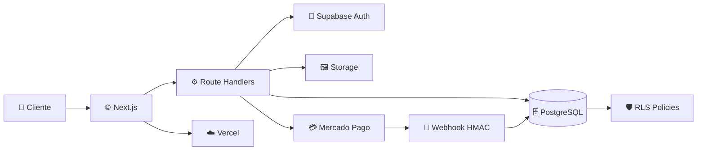
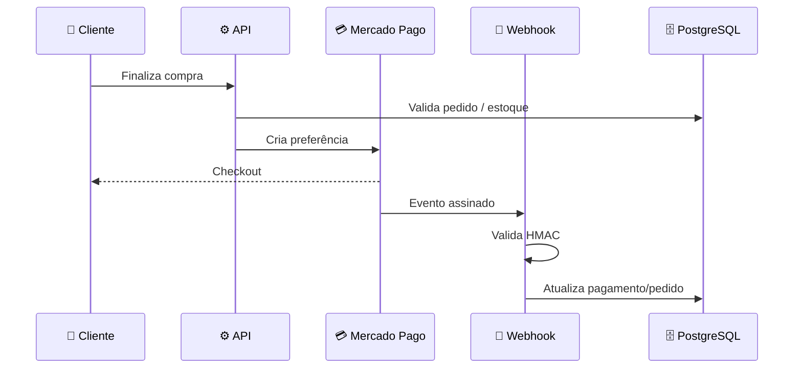
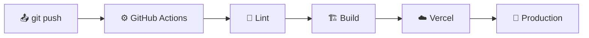

<div align="center">


# 🛍️ Loja

### E-commerce full-stack brasileiro, moderno e seguro

[](https://nextjs.org/) [](https://react.dev/) [](https://www.typescriptlang.org/)

[](https://supabase.com/) [](https://www.mercadopago.com.br/) [](https://vercel.com/)

**⚡ Performance · 🔐 Security-first · 💳 Payments · 📦 Inventory · 👑 Admin · ☁️ Cloud**

<p>
  <a href="https://loja-nine-gold.vercel.app/">🚀 Demo</a> •
  <a href="https://www.canva.com/d/l3K1BCLrMlMFhlp">🎨 Brand Deck</a> •
  <a href="https://github.com/XzGuuhXz/loja/issues">🐛 Issues</a>
</p>

</div>

---

## ✨ Sobre o projeto

> **Uma loja não deve apenas vender produtos. Ela precisa transmitir confiança em cada etapa da compra.**

A **Loja** é uma plataforma de e-commerce construída com foco em experiência, segurança e evolução. O frontend entrega uma jornada rápida e intuitiva, enquanto regras críticas — **preço, estoque, autorização e pagamentos** — permanecem protegidas no servidor e no banco de dados.

### 🎯 O que a Loja resolve

| 🛒 Para o cliente | 🧑‍💼 Para o negócio | 🛡️ Para a plataforma |
|:---:|:---:|:---:|
| Catálogo intuitivo | Gestão de produtos | RLS + Auth |
| Busca e filtros | Estoque | Server-side validation |
| Carrinho | Pedidos | Webhook HMAC |
| Checkout | Administração | Secrets protegidos |

---

## 🧭 Navegue pelo README

<details open>
<summary><strong>📚 Índice</strong></summary>

- [✨ Sobre](#-sobre-o-projeto)
- [🚀 Funcionalidades](#-funcionalidades)
- [🎨 Identidade visual](#-identidade-visual)
- [🏗️ Arquitetura](#️-arquitetura)
- [🔐 Segurança](#-segurança)
- [💳 Pagamentos](#-pagamentos)
- [🗄️ Banco de dados](#️-banco-de-dados)
- [📁 Estrutura](#-estrutura-do-projeto)
- [🧑‍💻 Desenvolvimento](#-desenvolvimento-local)
- [☁️ Deploy](#️-deploy)
- [📊 Status](#-status-atual)
- [🤝 Contribuição](#-contribuição)

</details>

---

## 🚀 Funcionalidades

### 🛍️ Experiência de compra

- 🏪 Catálogo de produtos
- 🔎 Busca e filtros por categoria
- 🖼️ Imagens com Supabase Storage
- 🛒 Carrinho de compras
- 👤 Cadastro, login e sessão
- 📦 Histórico e acompanhamento de pedidos
- 💳 Checkout integrado ao Mercado Pago

### 👑 Operação e administração

- 📋 CRUD de produtos
- 🗂️ CRUD de categorias
- 📊 Controle de estoque
- 🖼️ Upload e gerenciamento de imagens
- 📦 Gestão de pedidos
- 🔐 Autorização administrativa server-side

### ⚙️ Engenharia

- 🛡️ PostgreSQL + Row Level Security
- 🔏 Webhook de pagamento com HMAC
- ✅ Validação server-side com Zod
- 🔑 Secrets restritos ao servidor
- 🌐 Security headers
- 🔄 CI com lint e build
- ☁️ Deploy preparado para Vercel

---

## 🎨 Identidade visual

A Loja utiliza uma identidade **premium, tecnológica e limpa**, pensada para transmitir segurança sem perder conversão.

```text
┌──────────────────────────────────────────────────────────────┐
│  LOJA                                                         │
│  Construída para vender. Projetada para crescer.              │
│                                                              │
│  █ Grafite       █ Branco       █ Esmeralda       █ Ciano     │
│                                                              │
│  Alto contraste • Espaço em branco • Cards • Microinterações  │
└──────────────────────────────────────────────────────────────┘
```

🎨 **Apresentação da identidade:** [abrir o Brand Deck no Canva](https://www.canva.com/d/l3K1BCLrMlMFhlp)

---

## 🏗️ Arquitetura



### 🧰 Stack tecnológica

| Tecnologia | Papel |
|---|---|
| **Next.js 15** | Framework full-stack e App Router |
| **React 19** | Interface e componentes |
| **TypeScript** | Tipagem e segurança de código |
| **Tailwind CSS** | Sistema visual |
| **Supabase Auth** | Autenticação |
| **PostgreSQL** | Banco de dados |
| **Supabase Storage** | Imagens |
| **Zod** | Validação |
| **Mercado Pago** | Pagamentos |
| **Vercel** | Hosting e deploy |
| **GitHub Actions** | CI |

---

## 🔐 Segurança

> **Security-first:** o frontend nunca é tratado como autoridade para dados críticos.

| Área | Estratégia |
|---|---|
| 🔐 Autenticação | Supabase Auth |
| 🛡️ Banco | PostgreSQL + RLS |
| 👑 Administração | Autorização server-side |
| 💰 Preços | Validação baseada no banco |
| 📦 Estoque | Operações protegidas no backend |
| 💳 Checkout | Preferência criada no servidor |
| 🔏 Webhook | HMAC |
| 🔑 Service Role | Apenas server-side |
| 🖼️ Upload | MIME + limite de tamanho |
| 🌐 HTTP | Security headers |
| 🚫 Git | Segredos fora do repositório |

---

## 💳 Pagamentos



As credenciais do Mercado Pago permanecem **server-only**.

---

## 🗄️ Banco de dados

```text
profiles
   ├── addresses
   └── orders
          └── order_items ─── products ─── categories
                                  └── product_images

carts
   └── cart_items ─── products
```

Principais entidades:

`profiles` · `addresses` · `categories` · `products` · `product_images` · `carts` · `cart_items` · `orders` · `order_items`

---

## 📁 Estrutura do projeto

```text
loja/
├── app/
│   ├── api/pagamento/
│   ├── admin/
│   ├── auth/
│   ├── carrinho/
│   ├── pedidos/
│   ├── produtos/
│   ├── error.tsx
│   ├── layout.tsx
│   └── page.tsx
│
├── components/
├── lib/supabase/
├── supabase/migrations/
├── public/
├── assets/
├── .github/workflows/
├── .env.example
├── next.config.ts
├── package.json
└── README.md
```

---

## 🧑‍💻 Desenvolvimento local

```bash
git clone https://github.com/XzGuuhXz/loja.git
cd loja
npm install
npm run dev
```

Crie `.env.local` usando `.env.example` como referência:

```env
NEXT_PUBLIC_SUPABASE_URL=seu_url_publico
NEXT_PUBLIC_SUPABASE_PUBLISHABLE_KEY=sua_chave_publica
SUPABASE_SERVICE_ROLE_KEY=chave_apenas_no_servidor
NEXT_PUBLIC_SITE_URL=http://localhost:3000
MERCADOPAGO_ACCESS_TOKEN=
MERCADOPAGO_WEBHOOK_SECRET=
```

Valide antes de publicar:

```bash
npm run lint
npm run build
```

> ⚠️ **Nunca** commite valores reais de secrets.

---

## ☁️ Deploy

A arquitetura foi preparada para **Vercel + Supabase**.



### Variáveis de Production

```text
NEXT_PUBLIC_SUPABASE_URL
NEXT_PUBLIC_SUPABASE_PUBLISHABLE_KEY
SUPABASE_SERVICE_ROLE_KEY
NEXT_PUBLIC_SITE_URL
MERCADOPAGO_ACCESS_TOKEN
MERCADOPAGO_WEBHOOK_SECRET
```

---

## 📊 Status atual

| Módulo | Estado |
|---|:---:|
| Catálogo | ✅ |
| Busca e filtros | ✅ |
| Página de produto | ✅ |
| Carrinho | ✅ |
| Autenticação | ✅ |
| Pedidos | ✅ |
| Administração | ✅ |
| Produtos / categorias | ✅ |
| Storage / imagens | ✅ |
| Estoque | ✅ |
| Checkout | ✅ |
| Mercado Pago | ✅ |
| Webhook HMAC | ✅ |
| RLS | ✅ |
| CI / Build | ✅ |
| Production | ⚠️ Configuração de secrets |

> O projeto está em evolução. A publicação funcional em Production depende da configuração das variáveis necessárias na Vercel.

---

## 🧪 Checklist de produção

- [ ] Configurar secrets de Production
- [ ] Configurar domínio oficial
- [ ] Configurar webhook do Mercado Pago
- [ ] Testar autenticação
- [ ] Testar catálogo e filtros
- [ ] Testar carrinho
- [ ] Testar estoque
- [ ] Testar checkout
- [ ] Validar webhook HMAC
- [ ] Revisar RLS
- [ ] Executar lint + build
- [ ] Fazer deploy
- [ ] Validar aplicação publicada

---

## 🤝 Contribuição

```bash
git checkout -b feature/minha-melhoria
git add .
git commit -m "feat: minha melhoria"
git push origin feature/minha-melhoria
```

Depois, abra um Pull Request.

---

<div align="center">

## 🛍️ LOJA

### **Construída para vender. Projetada para crescer.**

**Simple for customers. Powerful for business. Secure by architecture.**

⭐ Se este projeto foi útil, considere deixar uma estrela.

</div>
